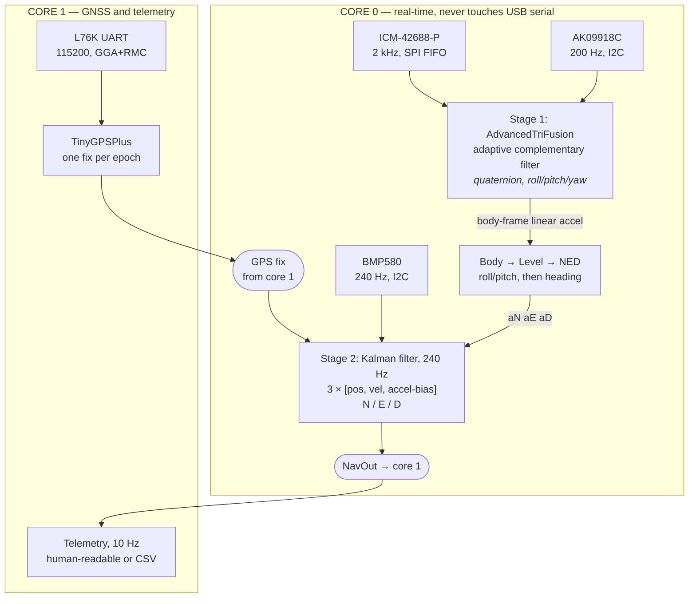
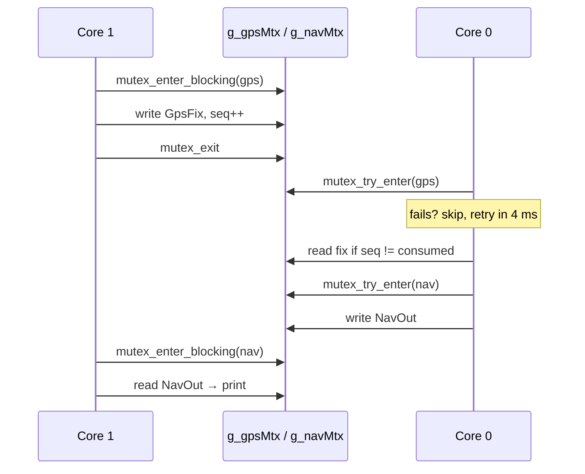

# GPS / INS Localization — how it works

Detailed reference for `GPS_INS_Localization.ino`: a loosely-coupled inertial navigation system that fuses the Voltino TriSense (ICM-42688-P + AK09918C + BMP580) with a Quectel L76K GNSS receiver on a Raspberry Pi Pico 2 (RP2350).

For the short version, see the *GPS / INS Localization* section in the [library README](../../README.md).

---

## Contents

1. [What it produces](#1-what-it-produces)
2. [Hardware and dependencies](#2-hardware-and-dependencies)
3. [First run: three things to configure](#3-first-run-three-things-to-configure)
4. [Architecture](#4-architecture)
5. [Coordinate frames](#5-coordinate-frames)
6. [The navigation filter](#6-the-navigation-filter)
7. [Measurement sources](#7-measurement-sources)
8. [Timing and rates](#8-timing-and-rates)
9. [Dual-core design](#9-dual-core-design)
10. [GNSS bring-up](#10-gnss-bring-up)
11. [Tuning guide](#11-tuning-guide)
12. [Output format](#12-output-format)
13. [Troubleshooting](#13-troubleshooting)
14. [Known limitations](#14-known-limitations)
15. [Code map](#15-code-map)

---

## 1. What it produces

| Output | Symbol in `NavOut` | Units | Source |
|---|---|---|---|
| Orientation | `roll`, `pitch`, `yaw` | deg | `AdvancedTriFusion` |
| Quaternion | `q[4]` (w, x, y, z) | — | `AdvancedTriFusion` |
| Acceleration | `aN`, `aE`, `aD` | m/s² | World frame, gravity **and** estimated bias removed |
| Velocity | `vN`, `vE`, `vD` | m/s | Kalman filter |
| Position (local) | `pN`, `pE`, `pD` | m from origin | Kalman filter |
| Position (geodetic) | `lat`, `lon`, `altMSL` | deg, m | Local position projected back onto WGS84 |
| Accuracy | `sigmaPosH`, `sigmaPosV`, `sigmaVelH` | m, m/s | √ of the filter's own covariance diagonal |
| Learned bias | `biasN`, `biasE`, `biasD` | m/s² | Kalman filter |
| Health | `fifoOverflows`, `fixAgeMs`, `sats`, `hdop`, `zupt` | — | Diagnostics |

The accuracy figures are the filter's honest self-assessment, not a fixed advertised number. They grow during GPS outages and shrink after a good fix — watch `sigmaPosH` to see the filter's confidence in real time.

**Why this example exists at all:** `AdvancedTriFusion` gives drift-free *orientation*, but it cannot give you *position*. Integrating acceleration twice turns a 0.01 m/s² residual bias into 18 m of error in one minute. Position needs an absolute reference, and that means GNSS.

---

## 2. Hardware and dependencies

```
Raspberry Pi Pico 2 (RP2350)
├── SPI  ── ICM-42688-P   CS = GP17, 10 MHz
├── I2C  ── AK09918C + BMP580   (400 kHz, set by the sketch)
└── UART ── Quectel L76K   GP0 = Pico TX -> module RX
                           GP1 = Pico RX <- module TX
```

- **Core:** [arduino-pico](https://github.com/earlephilhower/arduino-pico) by Earle Philhower. The sketch uses `setup1()`/`loop1()`, `Serial1.setTX()/setRX()` and the Pico SDK mutex API, so it will not build on the Arduino mbed core. It `#error`s on non-RP2040/RP2350 targets rather than failing silently.
- **Library:** [TinyGPSPlus](https://github.com/mikalhart/TinyGPSPlus) by Mikal Hart. Example-only — it is deliberately *not* a dependency of the TriSense library itself.

---

## 3. First run: three things to configure

### 3.1 Magnetometer calibration — do this first

```cpp
static float MAG_HARD_IRON[3] = { -46.02f, -0.85f, -46.00f };
static float MAG_SOFT_IRON[3][3] = { ... };
```

Run the `MotionCal` example and paste your own numbers in. This is not optional polish: heading error rotates your *entire velocity vector*, so a 10° heading error sends the position estimate off at 10° to reality regardless of how good everything else is.

### 3.2 Magnetic declination

```cpp
#define MAGNETIC_DECLINATION  5.6f   // degrees East, positive
```

Look yours up at [magnetic-declination.com](https://www.magnetic-declination.com/). GPS course over ground is relative to **true** north, so if this is wrong the fused heading and the GPS course will never agree.

### 3.3 Yaw sense

```cpp
#define YAW_IS_COMPASS_HEADING 1
```

The sketch rotates acceleration into North/East using `getOrientationDegrees()`'s yaw, so it must know whether that number is a **clockwise compass heading** (0 = N, 90 = E) or a **counter-clockwise bearing** (0 = N, 90 = W).

On the TriSense Pro it is a compass heading, hence the default. The switch remains because the answer depends on how the AK09918C's axes sit relative to the ICM-42688-P — a board-layout property, not something the library source settles.

Two ways to confirm on your unit:

- Point the board's **+X axis East**. Compass heading → yaw reads ~90. Counter-clockwise → ~270.
- Just run the sketch and travel in a straight line above 2 m/s. It accumulates 60 samples comparing yaw against GPS course over ground and prints a one-time verdict:

```
[CHECK] Yaw tracks GPS course - YAW_IS_COMPASS_HEADING is correct.
```

That check doubles as a magnetometer-calibration and declination test, since a bad hard-iron fit shows up as heading that will not track course.

> If you ever set this to `0`, also **negate `MAGNETIC_DECLINATION`** — the library adds declination to that same yaw value, so a counter-clockwise yaw needs the opposite sign to end up at true north.

---

## 4. Architecture

A **cascade**, not one monolithic filter:



| Stage | Estimator | Rate | Job |
|---|---|---|---|
| **1 — Attitude** | `AdvancedTriFusion` (adaptive complementary filter) | IMU ODR, 2 kHz | Gyro integration corrected by accelerometer and magnetometer with Gaussian confidence gating |
| **2 — Navigation** | Linear Kalman filter, `x = [position, velocity, accel-bias]` per axis | 240 Hz | Position and velocity, corrected by GPS, barometer and ZUPT |

### 4.1 Why not a 15-state ESKF?

An error-state Kalman filter is the textbook answer, and it genuinely wins in one regime: **long GNSS outages under high dynamics**, where attitude error and velocity error are strongly correlated and the filter must recover *heading* from GPS. It costs a 15×15 covariance propagation — thousands of multiply-adds — every step.

Here the magnetometer already observes heading directly and the accelerometer already observes tilt, so that cross-coupling buys very little. The cascade costs a small fraction of the arithmetic and is far easier to tune and debug.

**Upgrade to an ESKF if:** you fly a fast fixed-wing with no usable magnetometer, or you need to coast through GNSS outages measured in minutes rather than seconds.

### 4.2 Why a Kalman filter for stage 2, and not another complementary filter?

Two reasons, both structural:

1. **GPS accuracy varies by an order of magnitude** with HDOP and satellite count. A Kalman filter weights each measurement by its actual variance; a fixed-gain filter must be tuned for the worst case and is then wrong everywhere else.
2. **Accelerometer bias must be *estimated*, not assumed.** A complementary filter has no state in which to put it.

### 4.3 Why three 3-state filters instead of one 9-state filter?

Because attitude is supplied externally, the 9-state system has a special structure:

- The system matrix **F** is exactly block diagonal per axis (N, E, D do not interact).
- The process noise **Q** is diagonal.
- Every measurement touches **exactly one axis** (GPS-North corrects only the N states, and so on).

A block-diagonal covariance therefore *stays* block diagonal forever. Three 3×3 filters are **mathematically identical** to one 9×9 filter, at roughly a ninth of the arithmetic. This is an exact factorization, not an approximation.

The consequence worth noting: because every measurement is scalar and observes a single state directly, the Kalman update collapses to a handful of operations. **There is no matrix inversion anywhere in this sketch.**

---

## 5. Coordinate frames

This is the part that is easiest to get subtly wrong, so it is spelled out.

| Frame | Axes | Where it appears |
|---|---|---|
| **Body** | X forward, Y **left**, Z up (right-handed) | Raw IMU, `fusion.lastAx/Ay/Az`, `getLinearAcceleration()` |
| **Level** | Forward, Left, Up — body de-rotated by roll and pitch only | Intermediate, inside `navStep()` |
| **Navigation** | North, East, Down | The Kalman filter's world |

### 5.1 Body → Level

Applying `Ry(pitch)·Rx(roll)`:

```cpp
aFwd  =  ct*bx + st*sp*by + st*cp*bz;
aLeft =          cp*by    - sp*bz;
aUp   = -st*bx + ct*sp*by + ct*cp*bz;
```

Roll and pitch come straight from gravity and are unambiguous — they do not depend on the yaw convention at all.

### 5.2 Level → North/East/Down

Body **+Y is 90° to the LEFT of +X** in a right-handed Z-up frame, so with ψ the compass heading, the nose points along heading ψ and the left wing along ψ − 90°:

```cpp
aN =  aFwd*cos(psi) + aLeft*sin(psi);
aE =  aFwd*sin(psi) - aLeft*cos(psi);
aD = -aUp;
```

Sanity check at ψ = 45° (NE): `aLeft = 1` gives (0.707, −0.707) = NW. Correct — the left wing of a north-easterly heading points north-west.

### 5.3 Why not `getGlobalAcceleration()`?

Because with a clockwise compass yaw it does not produce a consistent geographic frame. `initOrientation()` builds the quaternion as `Rz(+yaw)`, whereas a geographic frame needs `Rz(−heading)`. The two agree along body +X and come out mirrored for body +Y. At heading 45°:

| Body vector | True N/E | `getGlobalAcceleration()` |
|---|---|---|
| +X (nose) | (0.707, 0.707) = NE ✔ | (0.707, 0.707) ✔ |
| +Y (left) | (0.707, −0.707) = NW | (−0.707, 0.707) = **SE ✘** |

So the sketch uses `getLinearAcceleration()` instead — body frame, and **yaw-independent**, because the gravity vector it removes is the third row of the rotation matrix, `[−sinθ, cosθ·sinφ, cosθ·cosφ]`, a function of roll and pitch only — and performs the heading rotation itself. Roll, pitch and the vertical channel are unaffected either way.

### 5.4 Geodetic ↔ local tangent plane

The origin is set at the first good GPS fix. Radii of curvature are computed **once**, at that origin:

```cpp
metersPerRadLon = (a / sqrt(w)) * cos(lat);        // prime vertical × cos(lat)
metersPerRadLat = (a * (1 - e2)) / (w * sqrt(w));  // meridian
```

with `w = 1 − e²·sin²(lat)`, `a = 6378137.0`, `e² = 6.69437999014e-3` (WGS84). A tangent plane built from these is sub-metre accurate over a few tens of kilometres, and costs two transcendental calls *once* rather than a full geodetic projection per fix.

> **The lat/lon subtraction must happen in `double`.** At 50° latitude a `float` resolves ~4×10⁻⁶ degrees — about **0.4 m** of quantization. This is the one place doubles are unavoidable, and it is only a handful of operations per fix.

---

## 6. The navigation filter

### 6.1 State

Per axis, `x = [ position, velocity, acceleration-bias ]`:

| Continuous model | |
|---|---|
| ṗ = v | |
| v̇ = (u − b) + w_a | `u` = measured world-frame acceleration, `w_a` ~ `ACC_PSD` |
| ḃ = w_b | `w_b` ~ `ACC_BIAS_RW` |

**What the bias state really absorbs** matters more than the name suggests. It soaks up anything that looks like a constant acceleration offset in the navigation frame:

- true accelerometer bias,
- an error in the local gravity constant,
- and most importantly, **a small residual tilt error**, which projects gravity onto the horizontal axes.

That last one dominates. 1° of tilt error injects 0.17 m/s² of phantom horizontal acceleration — far larger than the ICM-42688-P's own bias — which is why estimating this state matters so much more than the datasheet figure implies.

### 6.2 Predict — `kfPredict()`

State transition:

```
F = ⎡ 1  dt  −dt²/2 ⎤
    ⎢ 0   1  −dt    ⎥
    ⎣ 0   0   1     ⎦
```

Propagation, with `a = u − b`:

```cpp
x[0] += x[1]*dt + a*dt²/2;
x[1] += a*dt;
// x[2] constant across a step; the random walk enters through Q
```

`P ← F·P·Fᵀ + Q` is written out longhand rather than looped, because the zeros in F make a generic 3×3 product mostly multiplications by zero.

Process noise uses the **continuous white-noise-acceleration** discretization:

```
Q = ⎡ qa·dt³/3   qa·dt²/2   0     ⎤
    ⎢ qa·dt²/2   qa·dt      0     ⎥
    ⎣ 0          0          qb·dt ⎦
```

with `qa = ACC_PSD²` and `qb = ACC_BIAS_RW²`.

### 6.3 Correct — `kfCorrect()`

Every measurement observes a single state directly, so **H is a unit row** and the update collapses to:

```cpp
S = P[i][i] + R;
y = z - x[i];
if (y² > gate²·S) return false;      // innovation gate
K = P[:,i] / S;
x += K·y;
P -= K · P[i,:];
```

Two details that matter in practice:

- **The innovation gate** (`GATE_SIGMA`, default 4σ) rejects multipath and jumped fixes. But a filter that has genuinely diverged will reject *everything* — so `GPS_MAX_REJECTS` (12) consecutive rejections are taken to mean the filter is wrong, not the GPS, and it re-anchors on the GPS fix with a re-opened covariance.
- **P is re-symmetrized after every update.** In single precision the short-form covariance update accumulates asymmetry over millions of steps, and an asymmetric P eventually goes indefinite and takes the filter with it. Three averaging operations prevent that permanently.

### 6.4 Initial covariance

```cpp
kfReset(kfN, 0, 0, 100.0f, 2.0f, 0.5f);   // σ_pos 100 m, σ_vel 2 m/s, σ_bias 0.5 m/s²
kfReset(kfE, 0, 0, 100.0f, 2.0f, 0.5f);
kfReset(kfD, 0, 0,  10.0f, 1.0f, 0.5f);   // vertical starts better known — baro works from boot
```

---

## 7. Measurement sources

### 7.1 GPS position

```
σ = GPS_UERE_M × HDOP × trust(accel)
```

**Latency compensation.** An NMEA fix describes where you *were*, not where you are. The measurement is extrapolated forward using the filter's own velocity:

```cpp
lag = GPS_LATENCY_S + (millis() - fix.stampMs)/1000;
zN += kfN.x[1] * lag;
```

At 20 m/s an uncorrected 150 ms lag is a 3 m position error that the filter would otherwise be forced to interpret as real motion. `fix.stampMs` is set when the sentence completed, so the total covers both receiver processing lag and any delay in the cross-core handoff.

### 7.2 GPS velocity

From RMC speed + course. This is a stronger measurement than its position counterpart for two reasons: it is **Doppler-derived** rather than differenced positions, and it is **independent of the INS drift it is correcting**.

Two caveats are handled:

- Course over ground is meaningless when barely moving, so it is gated on `GPS_COURSE_MIN_MPS` (1.0 m/s).
- The measurement is stale, so it is aged forward by the acceleration the IMU measured in the meantime: `vN + aN·lag`.

### 7.3 GPS trust — HDOP and measured acceleration

```cpp
static float gpsAccelTrust(float accelG) {
  if (accelG <= GPS_ACCEL_KNEE_G) return 1.0f;
  return min(1 + GPS_ACCEL_SLOPE*(accelG - GPS_ACCEL_KNEE_G), GPS_ACCEL_MAX_MULT);
}
```

**HDOP is the dominant term and enters linearly** — that is what a dilution of precision *is*. Across its usable range (0.8 up to the `GPS_MAX_HDOP` reject threshold) it swings σ by 7× on its own. Handling that correctly is precisely the job a fixed-gain filter cannot do.

On top of it, σ inflates once measured specific force passes the knee (default 2 g). High acceleration is both when fix latency hurts most — 150 ms at 4 m/s² is 0.6 m/s of velocity error, scaling linearly — and when a receiver's tracking loops are under the most stress.

Driving this from **measured** acceleration rather than a mode flag keeps it continuous and requires no knowledge of what the vehicle is doing.

Fixes are hard-rejected below `GPS_MIN_SATS` (4) or above `GPS_MAX_HDOP` (6.0).

### 7.4 Barometer

The barometer is the **primary altitude source**; GPS only supplies the datum.

```cpp
z_D = originAlt − (baroAlt + baroOffset)
```

`readAltitude()` uses a fixed 101325 Pa reference, so it returns *pressure altitude*, which can sit ±200 m from true MSL depending on weather — but it is extremely **stable**. So:

- `baroOffset` ≈ (true MSL) − (pressure altitude). Snapped exactly on the first GPS fix, then tracked toward GPS altitude with a `BARO_TRACK_TAU_S` (90 s) first-order filter.
- **Short-term altitude comes entirely from the barometer** — decimetre-class, no drift over minutes.
- **The long-term datum comes from GPS** — 2–3× worse than horizontal, but unbiased. The 90 s constant is what absorbs weather drift.

**Before any GPS fix**, `originAlt` is the pressure altitude at power-up and `baroOffset` is 0, so the vertical channel works from boot as a relative altimeter. Reported altitude is then relative-to-boot and re-anchors to true MSL on the first fix.

**Vertical velocity is never measured.** GGA and RMC carry no vertical speed. `vD` comes from the Kalman filter differentiating the barometer through the state model — which is exactly what a KF does well, and far better behaved than a naive derivative.

### 7.5 Zero-velocity updates (ZUPT)

```cpp
quiet = |‖a‖ − 1 g| < ZUPT_ACC_TOL_G  &&  Σ|gyro| < ZUPT_GYRO_TOL_DPS
zupt  = quiet sustained for ZUPT_HOLD_MS
```

When active, a `v = 0` pseudo-measurement is applied on all three axes with a very tight σ (0.02 m/s) and **no innovation gate** — a diverged filter is precisely the case ZUPT exists to rescue.

Cheap, and the single most effective thing in this filter: **standing still is the only condition under which accelerometer bias is directly observable.** Without ZUPT, a parked vehicle slowly "drives away" between GPS fixes.

### 7.6 Local gravity

On the first fix, the WGS84 Somigliana formula with a free-air correction replaces the nominal 9.80665:

```cpp
g = 9.7803253359 · (1 + 0.00193185265241·sin²φ) / √(1 − 0.00669437999013·sin²φ) − 3.086e-6·h
```

Removes an offset of up to 0.03 m/s² that the bias state would otherwise have to chase.

---

## 8. Timing and rates

| What | Rate | Why |
|---|---|---|
| IMU ODR | 2 kHz | See below |
| Attitude fusion | IMU ODR | Every FIFO packet is integrated; none are dropped |
| Kalman predict | 240 Hz | Matches the barometer |
| Barometer read | 240 Hz | The driver's maximum |
| Telemetry | 10 Hz | Core 1 |

### 8.1 Why 240 Hz for the filter?

Because there is no reason not to. A Kalman step here is three axes of 3×3 covariance propagation plus a frame rotation — about 800 cycles including the Euler extraction. At 240 Hz on a 150 MHz M33 that is **0.13% of one core**.

Running slower would buy nothing and cost measurement latency: a barometer sample arriving between steps cannot be applied until the next one, and at 100 Hz that is up to 10 ms of unnecessary lag on the altitude channel.

`dt` is **measured**, not assumed, and clamped to 0.25 s so a stalled loop cannot inject a wild time-step.

### 8.2 Why the barometer's IIR filter is off

Matching the read rate to the sensor ODR means every sample is used exactly once — and that changes the right answer on filtering:

- An IIR filter exists to stop content above Nyquist **aliasing** when you sample slower than the ODR. Sampling *at* the ODR means there is nothing to alias.
- Leaving it on adds group delay.
- Worse, it **correlates consecutive samples**, and feeding correlated measurements to a Kalman filter at full rate makes it over-confident, because the filter counts each one as independent evidence.

Oversampling is ×2, the only setting that sustains 240 Hz. Per sample that is ~11 cm of noise against ~4 cm at ×8, but 240 Hz delivers ~10× the samples and uncorrelated noise averages down as √N inside the filter. The trade is worth taking.

> **Configuration registers only latch reliably in standby.** The sketch brackets all BMP580 config writes in `BMP580_MODE_STANDBY` — writing them while the sensor is running can silently do nothing.

### 8.3 Why 2 kHz for the IMU, not 8 kHz

**Not an accuracy compromise.** First-order quaternion integration loses about `(ω·dt)³/12` rad per step. At 2 kHz and a full-scale 2000 °/s slew that is 0.05 °/s — half a degree over a ten-second aerobatic sequence, at the gyro's *maximum* rate. (At 200 Hz the same figure is 5 °/s, which is where it does break.)

The real reason to raise it is **vibration averaging**: each nav step averages one batch of accelerometer samples, so a higher ODR gives a cleaner mean. Cost at 8 kHz is ~2% of one core.

```
ODR_1KHZ / ODR_2KHZ   rovers, boats, cars, handheld trackers, fixed-wing
ODR_4KHZ / ODR_8KHZ   multirotors — anything with props on the same frame
```

If you see `!! IMU FIFO OVERFLOW` in the log, the loop is not draining fast enough — **lower** this rather than living with dropped packets, which are rotation that can never be recovered.

### 8.4 The acceleration accumulator

`loop()` drains the FIFO as fast as it fills. Each `fusion.update()` that returns true contributes the mean of one FIFO batch to `accSum`/`accCount`; `navStep()` takes the mean of those and resets the accumulator.

Batches are near-uniform in size when the loop runs freely, so an unweighted mean of batch means is within noise of a true sample mean. If `accCount == 0`, the nav step is **skipped and `dt` is not consumed** — the filter never predicts on stale data.

---

## 9. Dual-core design

| | Core 0 | Core 1 |
|---|---|---|
| Owns | SPI, I2C, fusion, Kalman filter | UART1, USB serial |
| Never | Touches USB serial | Touches the sensors |
| Blocking | **Never** — `mutex_try_enter()` only | `mutex_enter_blocking()` |

A blocking print on the fusion core is the classic cause of IMU FIFO overflow, and dropped packets are rotation that can never be recovered. Separating them removes the failure mode rather than mitigating it.

Two small structs cross between cores, each with its own mutex:



- Core 0 only ever uses `mutex_try_enter()`. A missed handoff is retried on the next nav step ~4 ms later — telemetry is not worth stalling a real-time loop for.
- `g_gpsShared.seq` increments per published fix, and `consumedFixSeq` on core 0 ensures each fix is applied **exactly once**. `seq == 0` means "never had a fix".
- `auto_init_mutex()` is used rather than `mutex_init()` in `setup()`, because arduino-pico **launches core 1 before core 0 reaches `setup()`** — a runtime init would be a race.

---

## 10. GNSS bring-up

### 10.1 PCAS checksums are computed at runtime

```cpp
static void gpsSend(const char *body);   // sends "$<body>*<XX>\r\n"
```

Command bodies are stored without checksums, so new PCAS commands can be added without hand-calculating one. (`gpsSend("PCAS01,5")` produces exactly `$PCAS01,5*19`.)

### 10.2 Auto-baud

The module keeps its baud rate across a Pico reset, so the sequence is:

1. Try **115200** — succeed if valid NMEA arrives within 1.5 s.
2. Otherwise try **9600** (factory default). If that works, send `$PCAS01,5`, reopen at 115200 and verify.
3. If the switch does not take, fall back to 9600 and drop to 1 Hz so the slower link is not saturated.
4. If neither baud produces NMEA, report a wiring/antenna problem.

### 10.3 Sentence trimming

```cpp
#define PCAS_NMEA_MINIMAL "PCAS03,1,0,0,0,1,0,0,0,0,0,,,0,0,,,,0"   // GGA + RMC only
```

GGA carries position, altitude, satellites and HDOP; RMC carries speed, course, date and time. Together they are **everything TinyGPSPlus parses**, so GSA/GSV/GLL/VTG are pure UART load — GSV alone can be four sentences per epoch.

If the firmware does not accept that field layout and goes quiet, the sketch detects the silence and restores the default sentence set rather than leaving the receiver mute.

### 10.4 One fix per NMEA epoch

RMC closes the standard sentence cycle, so the sketch publishes when `gps.date.isUpdated()` fires — at that point position, altitude, satellites, HDOP, speed and course all belong to the **same solution**.

> Publishing on every sentence instead would hand the filter the same fix two or more times, and it would treat each as independent evidence — making it over-confident.

A fallback publishes on `location.isUpdated()` if nothing has been published for 1.5 s, covering configurations where RMC is disabled.

### 10.5 Rate note

Not every L76K carrier accepts 10 Hz — the **Seeed XIAO L76K tops out at 5 Hz**. The `r` key sends the 10 Hz command; if the receiver goes quiet, that is why, and `s` recovers it.

---

## 11. Tuning guide

### 11.1 Process noise

```cpp
#define ACC_PSD_HORZ   0.25f   // m/s²/√Hz
#define ACC_PSD_VERT   0.35f
#define ACC_BIAS_RW    0.004f  // m/s²/√s
```

`ACC_PSD` is the acceleration noise **density** driving velocity. The ICM-42688-P itself is around 0.0007 — the defaults are two orders larger *on purpose*, because what actually perturbs the velocity estimate is residual attitude error and vibration, not sensor noise.

| Symptom | Change |
|---|---|
| Output lags real motion, feels "sticky" | **Raise** `ACC_PSD_*` |
| Output jitters between GPS fixes | **Lower** `ACC_PSD_*` |
| Bias estimate wanders visibly | **Lower** `ACC_BIAS_RW` |
| Bias never converges after a long run | **Raise** `ACC_BIAS_RW` |

### 11.2 Measurement noise

| Constant | Default | Meaning |
|---|---|---|
| `GPS_UERE_M` | 2.2 | m of horizontal error per unit HDOP |
| `GPS_VEL_SIGMA` | 0.25 | m/s at HDOP 1 |
| `BARO_ALT_SIGMA` | 0.5 | m — see below |
| `ZUPT_VEL_SIGMA` | 0.02 | m/s — how hard a standstill pins velocity |

> **`BARO_ALT_SIGMA` is set from the atmosphere, not the sensor.** Per sample the BMP580 contributes ~11 cm, and at 240 Hz that averages down fast. What does *not* average down is the air — wind gusts, prop wash, a passing vehicle, opening a car door — which is correlated over seconds. Quoting the sensor's figure here would make the filter over-confident in altitude and slow to accept a GPS correction.

### 11.3 GPS trust

| Constant | Default | Meaning |
|---|---|---|
| `GPS_ACCEL_KNEE_G` | 2.0 | No extra de-weighting below this specific force |
| `GPS_ACCEL_SLOPE` | 1.0 | σ multiplier added per g above the knee |
| `GPS_ACCEL_MAX_MULT` | 6.0 | Cap |

The 2 g knee is loose enough that ordinary driving, walking and boat motion never trip it. Lower it if GPS visibly fights the filter under hard acceleration; raise it for a platform that lives at high g.

### 11.4 Gating

| Constant | Default | Meaning |
|---|---|---|
| `GATE_SIGMA` | 4.0 | Reject a measurement further than this from the prediction |
| `GPS_MAX_REJECTS` | 12 | Consecutive rejections before re-anchoring on GPS |

Tighter gating rejects more multipath but risks locking out a filter that has genuinely drifted — which is what `GPS_MAX_REJECTS` exists to break.

### 11.5 ZUPT

| Constant | Default | Meaning |
|---|---|---|
| `ZUPT_ACC_TOL_G` | 0.04 | \|accel\| must be within this of 1 g |
| `ZUPT_GYRO_TOL_DPS` | 2.0 | Sum of \|gyro\| below this |
| `ZUPT_HOLD_MS` | 300 | Must stay quiet this long |

> ⚠️ **The 1 g test alone does not mean "stationary."** Anything in steady-state free fall at terminal velocity — drag balancing weight — reads exactly 1 g with a quiet gyro. On a platform that can do that, gate ZUPT on an external condition as well, or it will pin velocity to zero while you are still moving.

---

## 12. Output format

### 12.1 Human-readable (default, 10 Hz)

```
RPY 0.4 -1.2 87.3 | a[NED] 0.02 -0.01 0.00 | v[NED] 4.21 0.15 -0.02
   | p[NED] 132.4 -8.1 -1.2 | 50.0874231 14.4211903 213.4m
   | +/-1.8m sats 11 hdop 0.9 age 120ms | GPS 1998Hz
```

| Field | Meaning |
|---|---|
| `RPY` | roll, pitch, yaw (deg) |
| `a[NED]` | world-frame acceleration, gravity **and** bias removed (m/s²) |
| `v[NED]` | velocity (m/s) |
| `p[NED]` | position from the origin (m) |
| lat lon alt | geodetic position |
| `+/-` | `sigmaPosH` — the filter's own 1σ horizontal accuracy |
| `age` | ms since the last GPS fix |
| mode | `GPS` = aided within 3 s, `INS` = dead reckoning; `+ZUPT` if a standstill is detected |
| Hz | measured fusion loop rate |

### 12.2 CSV (press `v`)

```
ms,roll,pitch,yaw,aN,aE,aD,vN,vE,vD,pN,pE,pD,lat,lon,alt,sigPos,sats,hdop,mode
```

Straight into a spreadsheet or a plotting script.

### 12.3 Runtime keys

| Key | Action |
|---|---|
| `d` | Toggle raw NMEA passthrough |
| `v` | Toggle CSV output |
| `z` | Reset the navigation filter and origin |
| `r` | GNSS to 10 Hz (not supported by all carriers) |
| `s` | GNSS to 1 Hz |
| `h` | Help |

---

## 13. Troubleshooting

| Symptom | Likely cause |
|---|---|
| `Sensor init failed` / `TriSense init FAILED` | SPI CS pin wrong, or I2C wiring. Core 1 reports this since core 0 parks. |
| `[GPS] No NMEA at 9600 or 115200` | TX/RX swapped, or no antenna / no sky view |
| `!! IMU FIFO OVERFLOW` | Loop not draining fast enough — lower `IMU_ODR`. Dropped packets are unrecoverable lost rotation. |
| Position mirrors East↔West | `YAW_IS_COMPASS_HEADING` wrong — see §3.3 |
| Heading drifts or will not track GPS course | Magnetometer calibration, or `MAGNETIC_DECLINATION` |
| `no fix yet` forever | `sats < 4` or `hdop > 6.0` — the origin is only set on a fix that passes both |
| Position creeps while parked | ZUPT not triggering — loosen `ZUPT_ACC_TOL_G` / `ZUPT_GYRO_TOL_DPS`, or check for vibration |
| Altitude jumps ~10 m occasionally | GPS altitude dragging the baro datum. Lengthen `BARO_TRACK_TAU_S`. |
| Filter ignores good GPS fixes | Innovation gate — watch for a re-anchor after 12 rejections; if it recurs, `GATE_SIGMA` is too tight or `ACC_PSD` too low |

A quick calibration check: with the board rotating, the corrected field magnitude should stay near-constant at your location's total field strength (~48–49 µT in central Europe).

---

## 14. Known limitations

- **Heading depends entirely on the magnetometer.** Park next to a steel structure and heading will be wrong, and a wrong heading rotates the whole velocity vector. The library's Gaussian anomaly rejection reduces the *rate* at which bad readings are absorbed, but nothing here recovers heading from GPS the way a full ESKF would.
- **Vertical velocity is inferred, never measured.** NMEA carries no vertical speed.
- **The batch-mean acceleration is rotated by the quaternion as it stands at the end of the batch.** Under high spin rates that is an approximation — keep the loop fast so batches stay short.
- **GPS latency compensation uses the filter's own velocity**, which correlates the measurement with the state. It is a standard, cheap approximation, not a rigorous delayed-state formulation.
- **No GNSS outage handling beyond dead reckoning.** After ~30 s without a fix, expect metres of horizontal drift depending on how well the bias state converged.
- **Not validated on hardware.** All constants are documented starting points.

---

## 15. Code map

### Core 0 — navigation

| Function | Role |
|---|---|
| `kfReset()` | Initialize one axis' state and covariance |
| `kfPredict()` | `x ← F·x + G·u`, `P ← F·P·Fᵀ + Q` |
| `kfCorrect()` | Scalar update with innovation gating and re-symmetrization |
| `kfSigma()` | √ of a covariance diagonal element |
| `wrap180()` | Angle difference helper |
| `localGravity()` | WGS84 Somigliana gravity + free-air correction |
| `setOrigin()` | Fix the tangent-plane origin; compute radii of curvature once |
| `resetNavigation()` | Reset filters, origin, baro datum, diagnostics |
| `takeGpsFix()` | Non-blocking pull of a fresh fix from core 1 |
| `gpsAccelTrust()` | σ multiplier from measured specific force |
| `applyGpsFix()` | Position, velocity, baro datum training, heading-sense diagnostic |
| `publishNav()` | Assemble `NavOut` and hand it to core 1 |
| `navStep()` | One filter iteration — the heart of the sketch |
| `setup()` / `loop()` | Sensor bring-up; FIFO drain and nav-step scheduling |

### Core 1 — GNSS and telemetry

| Function | Role |
|---|---|
| `gpsSend()` | Emit a PCAS command with a runtime-computed checksum |
| `gpsListening()` | Is valid NMEA arriving at the current baud? |
| `gpsOpen()` | Reopen UART1 at a given baud |
| `gpsConfigure()` | Auto-baud, rate, sentence trimming with restore-on-silence |
| `publishFix()` | Snapshot TinyGPSPlus state into the shared struct |
| `handleCommand()` | Runtime keys |
| `navModeName()` | `GPS` / `INS` / `+ZUPT` label |
| `printTelemetry()` | Human-readable or CSV output |
| `setup1()` / `loop1()` | Banner, GNSS bring-up; NMEA parse, commands, telemetry |

### `navStep()` — the eight stages

1. Mean body-frame linear acceleration since the last step
2. Body → level → North/East/Down
3. Kalman predict on all three axes
4. Barometric altitude correction
5. GPS correction, if a fresh fix is waiting
6. Standstill detection and ZUPT
7. *(implicit)* diagnostics — FIFO overflow, heading sense
8. Publish `NavOut` to core 1

---

## Further reading

- Groves, *Principles of GNSS, Inertial, and Multisensor Integrated Navigation Systems* — the standard reference for loosely- vs tightly-coupled integration and for the ESKF this deliberately is not.
- Farrell, *Aided Navigation* — good treatment of the tangent-plane approximation and of when it stops being valid.
